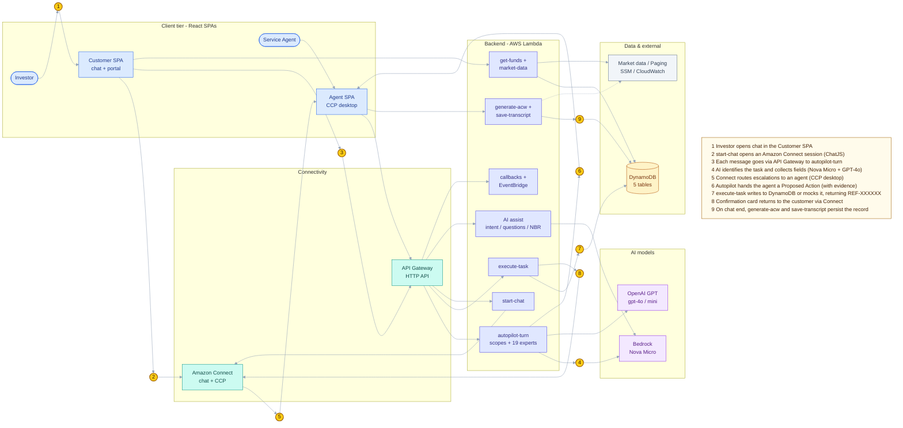
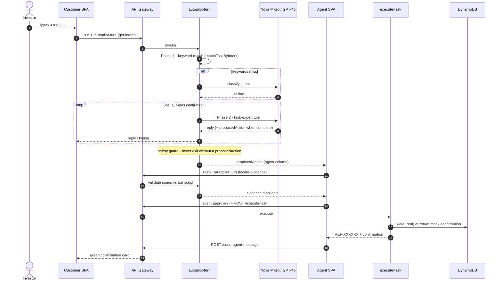
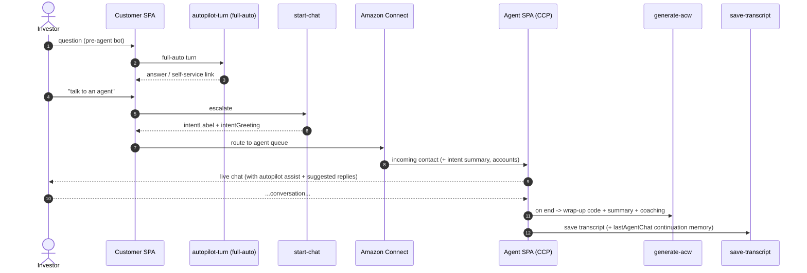
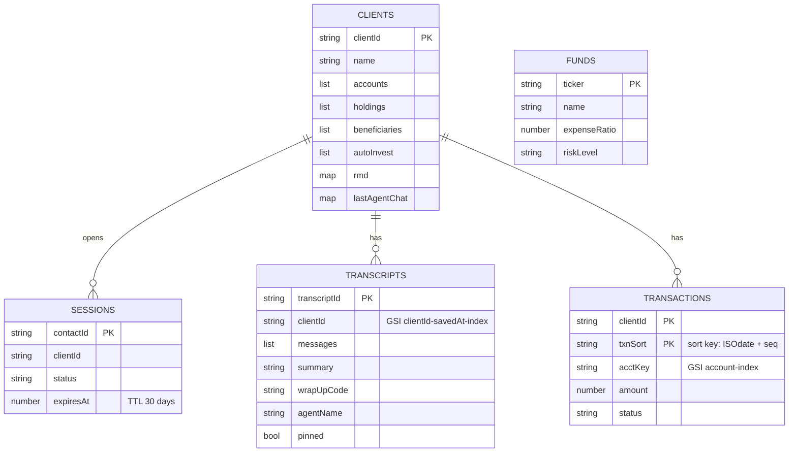
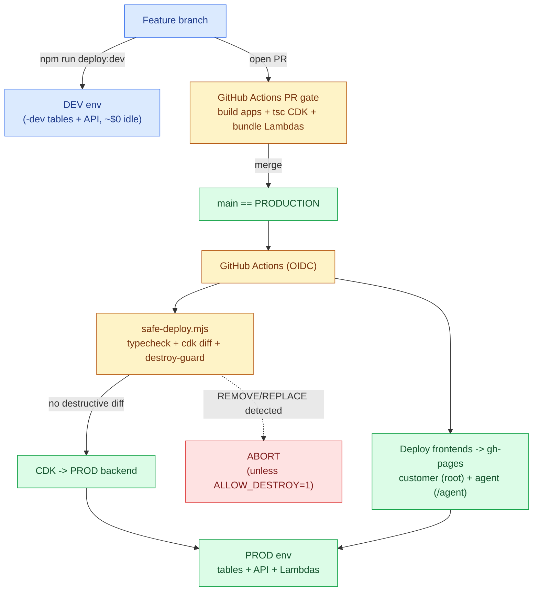

# Vanguard AI-Assisted Service Platform - Architecture

Companion to the [backlog](./README.md). Diagrams are authored in **Mermaid** (render inline on GitHub /
GitLab / Confluence / Jira) and exported to **SVG** so they stay crisp at any zoom and open in any browser -
see [`diagrams/`](./diagrams). Five views:

1. System overview (color-coded, with a numbered walkthrough) + the **How it works** narrative
2. Runtime sequence - autopilot task collection + agent approval
3. Runtime sequence - escalation and live-agent handoff
4. Data model (DynamoDB)
5. Environments & CI/CD

> **The platform in one sentence:** two React SPAs (an investor portal+chat and an agent console) talk to a
> fleet of AWS Lambdas behind an HTTP API; an autopilot Lambda drives every AI chat turn (Bedrock Nova Micro
> + OpenAI GPT), agents approve the resulting actions, and everything persists in DynamoDB - all serverless.

### Legend

| Color | Layer | | Symbol | Meaning |
|---|---|---|---|---|
| 🟦 Blue | Client tier (React SPAs) | | ①..⑨ gold circle | a step in the **How it works** walkthrough below |
| 🟩 Teal | Connectivity (Connect, API Gateway) | | solid line | request / data flow |
| 🟪 Indigo | Backend (AWS Lambda) | | dotted line | logging / secrets (cross-cutting) |
| 🟪 Purple | AI models | | | |
| 🟧 Amber | Data stores (DynamoDB) | | | |
| ⬜ Gray | External / infrastructure | | | |

---

## 1. System overview

Edges are kept light so the **gold numbered callouts** trace the main request lifecycle; the dense
"which Lambda uses which table/model" detail is captured in the [access matrix](#component-access-matrix)
below (a table reads cleaner than many crossing lines). Full message-by-message flows are in Diagrams 2-3.



### How it works (numbered walkthrough)

The gold circles ①..⑨ above mark each step of the primary lifecycle:

1. **Open chat.** The investor opens the chat widget on any portal page (Customer SPA).
2. **Start session.** The SPA creates an Amazon Connect chat session (`start-chat`) and connects over ChatJS.
3. **Each turn hits the API.** Every customer message flows Customer SPA -> API Gateway -> `autopilot-turn`
   (stateless, one invocation per message).
4. **AI identifies + collects.** `autopilot-turn` uses **Bedrock Nova Micro** (fast intent classification,
   the pre-agent bot) and **OpenAI GPT-4o** (the 19 task experts) to identify the task and collect every
   required field, reactively.
5. **Escalate to a human.** When a person is needed, Amazon Connect routes the contact to an available
   agent's CCP desktop (Agent SPA), with the AI-generated intent summary + suggested greeting attached.
6. **Proposed Action to the agent.** Once all fields are confirmed, autopilot hands the agent a Proposed
   Action card (with transcript evidence highlighting); the agent reviews and edits.
7. **Execute + persist.** On approval, `execute-task` writes to DynamoDB (real for beneficiaries / auto-
   invest / RMD; a realistic mock confirmation otherwise) and returns a `REF-XXXXXX` reference.
8. **Confirm to the customer.** The confirmation is pushed back to the customer's chat as a green card via
   Amazon Connect (`send-agent-message`).
9. **Wrap up.** When the chat ends, `generate-acw` produces the wrap-up code / summary / coaching and
   `save-transcript` persists the full record (+ continuation memory) to DynamoDB.

**Supporting flows (not numbered):** AI assist (`predict-intent` / `predict-questions` /
`next-best-response`) powers the chat pills + the agent's suggestions; `get-funds` / `market-data` supply
fund data; callbacks (`schedule-callback` / `execute-callback` via EventBridge) handle phone callbacks; all
Lambdas log to CloudWatch and read secrets from SSM at deploy.

### Component access matrix

What each Lambda touches (this is the detail intentionally kept out of the diagram to avoid crossing lines):

| Lambda(s) | DynamoDB | AI model | Other |
|---|---|---|---|
| `autopilot-turn` | Clients (read, via tools) | Nova Micro + GPT-4o | Amazon Connect |
| `start-chat` | Sessions (write) | Nova Micro | Amazon Connect |
| `execute-task` | Clients (write), Transactions (write) | - | - |
| `client-data` | Clients (r/w), Transactions (r/w) | - | - |
| `save-transcript` | Transcripts (write), Clients (write) | Nova Micro (recap) | - |
| `get-transcripts`, `pin-transcript` | Transcripts (r/w) | - | - |
| `predict-intent`, `predict-questions`, `next-best-response` | - | Nova Micro | - |
| `generate-acw` | - | Nova Micro | - |
| `get-funds`, `reset-funds` | Funds (r/w) | - | - |
| `market-data` | - | - | Market-data provider |
| `schedule-callback`, `execute-callback` | - | - | EventBridge Scheduler |
| `send-agent-message`, `agent-connection`, `agent-availability` | - | - | Amazon Connect |
| `client-log` | - | - | On-call paging |
| `reset-all-data`, `reset-beneficiaries` | Clients (write), Transactions (write) | - | - |

### Where the 9 backlog Features live

| Feature (backlog) | Primary components |
|---|---|
| Client Self-Service Portal | Customer SPA (portal pages), `client-data`, DynamoDB Clients/Transactions |
| Conversational AI Assistant (Client Chat) | Customer SPA (chat), Amazon Connect (ChatJS), `start-chat`, `autopilot-turn` (full-auto) |
| AI Autopilot Engine | `autopilot-turn` (scopes + 19 experts), Bedrock Nova Micro, OpenAI GPT |
| Agent Workspace | Agent SPA (CCP desktop), `agent-connection`, `send-agent-message`, `generate-acw` |
| Task Execution & Fulfillment | `execute-task`, DynamoDB Clients/Transactions |
| Knowledge & Predictive Assistance | `predict-intent`, `predict-questions`, `next-best-response`, shared KB |
| Callback Scheduling | `schedule-callback`, `execute-callback`, EventBridge Scheduler |
| Fund Catalog & Market Data | `get-funds`, `reset-funds`, `market-data`, DynamoDB Funds |
| Platform, Infrastructure & Delivery | AWS CDK, GitHub Actions (OIDC), DynamoDB, SSM, CloudWatch, Budget |

---

## 2. Runtime sequence - autopilot task collection + agent approval

The core "AI does the work, the agent does the judgment" loop (autopilot `get-intent` scope). Expands
callouts ③-⑧ above into the message-by-message flow.



> **Type 3 (client-submitted) variant:** instead of the agent submitting, the agent's card reads "Send to
> client"; the customer approves it in their own chat, then the agent app runs the identical execute path.

---

## 3. Runtime sequence - escalation & live-agent handoff

Expands callout ⑤ (and ⑨, the wrap-up).



---

## 4. Data model (DynamoDB)



---

## 5. Environments & CI/CD



---

## Viewing / exporting

- **Best for zoom / sharing:** open the **SVG** files in [`diagrams/`](./diagrams) in any browser - vector,
  so they stay sharp at any zoom level. PNGs are included as a fallback.
  - `1-system-overview` · `2-autopilot-sequence` · `3-escalation-sequence` · `4-data-model` · `5-cicd-environments`
- **Inline:** GitHub / GitLab / Confluence / Jira (with Mermaid) render the diagrams above in place; in VS
  Code use the "Markdown Preview Mermaid Support" extension.
- **Re-render after edits** (SVG + PNG):
  ```
  npx -y @mermaid-js/mermaid-cli -i ARCHITECTURE.md -o diagrams/arch.svg -t neutral -b white
  npx -y @mermaid-js/mermaid-cli -i ARCHITECTURE.md -o diagrams/arch.png -t neutral -b white
  ```
  (add `-p puppeteer-config.json` in sandboxed/root environments - it passes `--no-sandbox`.)
